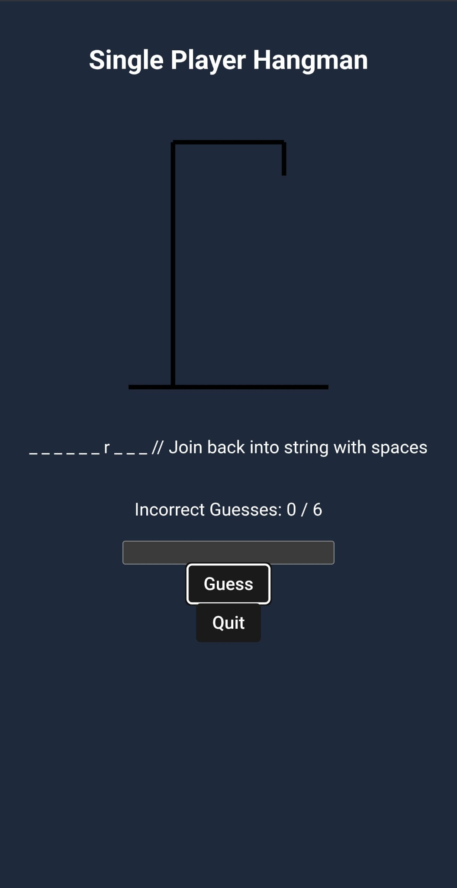

# 🎮 PlayPal Multiplayer

[PlayPal Multiplayer Live Demo 🕹️](https://playpal-multiplayer.netlify.app/)

PlayPal Multiplayer is a full-stack React gaming platform designed to bring classic tabletop and arcade-style games to the browser—anywhere, anytime. With PlayPal, you can sharpen your skills against intelligent AI opponents or challenge friends in real time. Built on React, Firebase, and Firestore, PlayPal delivers fast, secure, and responsive gameplay across desktop and mobile devices. Whether you’re decoding a word in Hangman, lining up four in Connect Four, lining up shots in Battleship, or dodging bullets in Duel Shots, PlayPal ensures an immersive, social experience complete with user profiles, friend requests, in-game chat, and push notifications.

---
## 🚀 Key Features

### 🎲 Universal Multiplayer & Single-Player Modes

- **Five Timeless Games, One Platform**  
  - **Hangman**  
    - **Single-Player**: Practice with random words from a curated dictionary. Each incorrect guess draws one more segment of the hangman figure—avoid six mistakes to survive.  
    - **Multiplayer**: Take turns guessing letters. Firestore ensures turn integrity, and in-game chat lets you taunt or encourage your opponent.  
  - **Tic-Tac-Toe (3×3)**  
    - **Single-Player**: Face off against a basic AI that picks random valid moves.  
    - **Multiplayer**: Alternate moves in real time. Winning combos are highlighted; Firestore rules enforce valid turns and detect draws instantly.  
  - **Connect Four (7×6)**  
    - **Single-Player**: AI will attempt a winning move, block you if needed, or select a random valid column. Perfect for practicing drop-and-stack strategy.  
    - **Multiplayer**: Drop discs against friends. Firestore syncs board updates and chat messages, so every drop, win, or tie is reflected instantly.  
  - **Battleship (10×10)**  
    - **Single-Player**: Two AI-generated boards with randomized ship placement. Sink your enemy’s fleet before they sink yours.  
    - **Multiplayer**: Place your fleet, then fire torpedoes at your friend’s grid. Hits, misses, and ship status sync in real time alongside in-game chat.  
  - **Duel Shots (Arena Shooter)**  
    - **Single-Player (Current Release)**: A top-down arena with randomized obstacles, ammo crates, and health pickups. AI dodges intelligently and auto-aims while you maneuver with virtual joysticks on mobile or WASD/arrow keys on desktop.  
    - **Multiplayer (Coming Soon)**: Face off against friends in chaotic head-to-head shootouts. All movement, shots, and pickups will synchronize through Firestore for ultra-low latency.  

- **Practice & Perfect Your Skills**  
  - Each game’s AI opponent adapts to provide a challenging experience.  
  - Instantly reset or rematch without reloading—play multiple rounds back-to-back.  

- **Seamless Turn Management**  
  - Firestore security rules enforce alternating turns so that only the designated player can make a move or fire a shot.  
  - Game status transitions from **pending** → **active** → **finished** automatically, with real-time updates to all participants.  

- **Automatic Cleanup & Rematch Support**  
  - Clicking “Quit” at any point deletes the Firestore game document, preventing stale data.  
  - “Rematch” either resets the existing game’s state (for draw or win/loss) or creates a fresh document for a brand-new session.  

---

### 👫 Social & Messaging Layer

- **🔍 Live Friend Search & Requests**  
  - Dynamic suggestions as you type (Firestore “startAt” / “endAt” queries).  
  - Sending a friend request:  
    1. Creates a “request” document under the recipient’s requests collection.  
    2. Creates a notification under that same user’s notifications collection.  

- **📬 Profile Page**  
  - **Friend Requests**:  
    - **Accept**:  
      - Moves both users into each other’s friends lists.  
      - Deletes the request document.  
    - **Decline**:  
      - Simply deletes the request document.  
  - **Friends List**: For each friend:  
    - **Message**: Opens a real-time chat window and triggers notifications on new messages.  
    - **Unfriend**: Removes both users from each other’s friends collections.  
    - **Block**:  
      - Removes friendship documents.  
      - Adds a document to your blocked collection to prevent challenges or messages.  

  - **Blocked Users**:  
    - **Unblock**: Deletes the blocked document (friendship must be re-requested to restore).  

- **📨 Real-Time One-on-One Chat**  
  - **Chat ID Generation**: Deterministic combination of two user IDs to ensure consistent message storage.  
  - **Message Structure**:  
    ```json
    {
      senderId: "string",
      receiverId: "string",
      content: "string",
      timestamp: "ISO String",
      isSeen: boolean,
      isSavedBySender: boolean,
      isSavedByReceiver: boolean
    }
    ```  
  - **Features**:  
    - Messages update live via Firestore’s `onSnapshot`.  
    - Unseen messages mark as “seen” when the chat loads.  
    - Clicking a message toggles its “saved” status—unsaved messages delete if neither party saves.  

- **🔔 Notifications Panel**  
  - Bell icon in both Dashboard and Profile headers shows unread notification count.  
  - Subscribes to a notifications collection for the logged-in user.  
  - **Notification Document Shape**:  
    ```json
    {
      type: "message" | "hangman_invite" | "tictactoe_invite" | "connect4_invite" | "battleship_invite" | "duel_invite",
      message: "string",
      senderId?: "string",
      senderUsername?: "string",
      gameId?: "string",
      timestamp: Timestamp
    }
    ```  
  - **Actions**:  
    - **Remove**: Deletes that notification document.  
    - **Accept Invite**: Updates the corresponding game document’s status to “active” and navigates into the match.  
    - **Open Message**: Navigates to chat view and removes that notification.  
    - **Mark All as Read** (Dashboard only): Bulk deletes all notification documents.  

---

### 📱 Responsive, Accessible UI

- **Touch & Keyboard Controls**  
  - **Board Games (Hangman, Tic-Tac-Toe, Connect Four, Battleship)**:  
    - Large tappable cells (≥ 48×48 px) on mobile.  
    - Hover and focus outlines on desktop.  
  - **Duel Shots**:  
    - Mobile: On-screen joystick for eight-direction movement and a “Shoot” button.  
    - Desktop: WASD/arrow keys to move; spacebar or mouse click to shoot.  

- **Clean, Consistent Styling**  
  - Component-level CSS modules (e.g., `HangmanGame.css`, `DuelGame.css`, `Dashboard.css`).  
  - High-contrast color palette, large fonts (≥ 16 px body, ≥ 24 px headings), and distinct hover/focus outlines for accessibility.  

- **Media Queries & Flexbox/Grid Layouts**  
  - **≥ 1024 px (Desktop)**: Game canvas and chat sit side-by-side.  
  - **600–1023 px (Tablet)**: Chat stacks beneath canvas; navigation collapses to a hamburger menu.  
  - **≤ 599 px (Mobile)**: Full-screen game canvas; chat toggles via a button.  

- **ARIA & Screen Reader Support**  
  - Buttons and inputs include `aria-label` attributes.  
  - Live regions announce opponent actions and incoming chat messages (e.g., “Opponent has moved—your turn”).  

---

### 🔧 Firebase Integration & Data Flows

- **Authentication**  
  - Email/password sign-up and login via Firebase Auth.  
  - Protected routes redirect unauthenticated users to the login screen.  
  - Global auth listener keeps React context in sync with Firebase user state.  

- **Firestore Structure (Overview)**  
  - **Users Collection**: Stores basic user profiles (username, email, createdAt).  
    - Subcollections for each user:  
      - **Friends**: Documents for each friend connection.  
      - **Requests**: Incoming friend requests.  
      - **Blocked**: Users that have been blocked.  
      - **Notifications**: Incoming notifications (game invites or chat alerts).  
  - **Chats Collection**: One subcollection per chat ID, containing individual message documents.  
  - **Game Collections**:  
    - Each game type (Hangman, Tic-Tac-Toe, Connect Four, Battleship, Duel Shots) has its own top-level collection.  
    - Documents include player IDs, game state (e.g., board array or ship positions), chat array, current turn, status (“pending” | “active” | “finished”), and winner.  

- **Security Rules (Sample)**  
  - Only authenticated users can read/write their own profile and its subcollections.  
  - Only the two participants of a given game document can read or update it, with Firestore rules enforcing turn-based writes.  
  - Chat messages can only be created by either player in that chat.  
  - Notification documents can only be created by the system when a friend request is sent or a game invite is issued.  

---

## 📷 Screenshots

1. **Login**  
   

2. **SignUp**  
   

3. **Dashboard**  
   

4. **Profile – Friend Requests Section**  
   

5. **Messaging**  
   

6. **Hangman Single Player**  
   

7. **Hangman Challenge**  
   

8. **Hangman Multiplayer**  
   

9. **Tic Tac Toe Single Player**  
   

10. **Tic Tac Toe Challenge**  
    
    
11. **Tic Tac Toe Multiplayer**  
    

12. **Connect Four Single Player**  
    

13. **Connect Four Challenge**  
    

14. **Connect Four Multiplayer**  
    

15. **Battleship Single Player**  
    

16. **Battleship Challenge**  
    

17. **Battleship Multiplayer**  
    

18. **Duel Shots Singe Player**  
    

📄 License
Distributed under the MIT License. See LICENSE for details.
